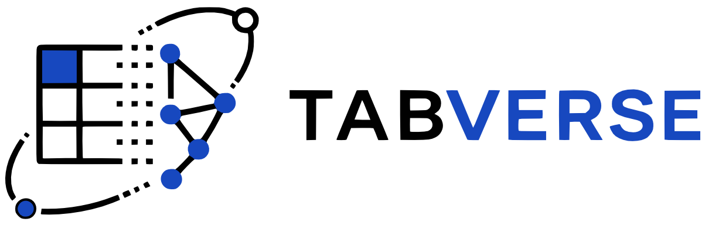

<p align="center">
  
</p>

<h3 align="center">Benchmarking Cross-Format Table Understanding in LLMs and VLMs</h3>

<p align="center">
  <a href="https://huggingface.co/datasets/MBZUAI/TABVERSE"></a>
  <a href="https://mbzuai-nlp.github.io/TABVERSE/"></a>
  <a href="docs/assets/dataset.pdf"></a>
  
  
  
  <br>
  <a href="https://creativecommons.org/licenses/by/4.0/"></a>
  <a href=".github/workflows/upload_hf.yml"></a>
  
  
</p>

A controlled multimodal table benchmark for evaluating **LLMs and VLMs** on cross-format
table understanding — **700 question–table pairs** (350 Easy, 350 Hard) from **629 unique tables**
rendered across HTML, Markdown, and LaTeX, with aligned PNG images.
Tasks span Structured Understanding & Comprehension (SUC), Question Answering (QA),
and Structure Reconstruction (SR) across text and vision pipelines.

## Dataset at a glance

|                  |                                                          |
| ---------------- | -------------------------------------------------------- |
| Q–Table pairs    | 700 (350 Easy · 350 Hard)                                |
| Unique tables    | 629                                                      |
| Formats          | HTML, Markdown, LaTeX (+ aligned PNG renderings)         |
| Tasks            | SUC, QA (Task Prediction), SR (Format Generation)        |
| Evaluation modes | LLM (text), VLM-Image (vision), VLM-Text (text-only VLM) |
| Source datasets  | FEVEROUS, HybridQA, SQA, TabFact, ToTTo                  |
| Models evaluated | 17 (open-weight VLMs, open-weight LLMs, GPT-4o, Gemini)  |

Unlike generic table benchmarks, every table is held-out from five established TableQA datasets
and converted into **three structural formats plus a rendered image** — allowing controlled
comparison of how format and modality interact, with table content held fixed.

The released dataset is on the Hugging Face Hub at
[`MBZUAI/TABVERSE`](https://huggingface.co/datasets/MBZUAI/TABVERSE).

## Quickstart

```python
from datasets import load_dataset

# Task Prediction (QA) — shows images in Dataset Viewer
qa = load_dataset("MBZUAI/TABVERSE", name="qa", split="test")
print(qa[0]["query"])          # natural-language question
qa[0]["html_image"]            # PIL Image of the HTML-rendered table
qa[0]["html_code"]             # raw HTML source

# SUC / Format Generation
suc = load_dataset("MBZUAI/TABVERSE", name="suc", split="test")
print(suc[0]["size_detection"])   # e.g. "118|9"
print(suc[0]["cell_value"])       # gold cell value
suc[0]["markdown_image"]          # PIL Image of the Markdown-rendered table
```

**Format generation (SR) with the `suc` config:**

```python
# HTML → Markdown generation
for row in suc:
    source = row["html_code"]     # input
    target = row["markdown_code"] # generation target
```

## How it's built

The benchmark is produced by a multi-stage pipeline. Each stage reads from `data/<N>-<name>/`
and writes the next — so any single transform can be re-run without disturbing the rest.

| Phase              | Stages / Modules                         | What happens                                                                                             |
| ------------------ | ---------------------------------------- | -------------------------------------------------------------------------------------------------------- |
| **Collection**     | `data/1-raw/`                            | Load held-out splits from FEVEROUS, HybridQA, SQA, TabFact, ToTTo; store raw `.jsonl` per source         |
| **Rendering**      | `src/renderers/`                         | Convert each table into HTML, Markdown, and LaTeX; render each format to an aligned PNG image            |
| **Tagging**        | `src/tagging/`, `data/2-task/`           | Annotate difficulty (Easy/Hard), assign task type (SUC / QA / SR); export per-task `.json` shards        |
| **SUC processing** | `src/process_linerize.py`, `data/3-suc/` | Build linearized representations for SUC sub-tasks (cell retrieval, row/column retrieval, summarization) |
| **Evaluation**     | `src/evaluation/`, `src/geneval.py`      | Score model outputs — exact match for SUC/QA; similarity + structural metrics for SR                     |

The final evaluation set is balanced: 350 Easy and 350 Hard pairs drawn from 629 unique tables.

## Repository layout

```
TABVERSE/
├── data/
│   ├── 1-raw/                  # raw .jsonl per source dataset
│   ├── 2-task/                 # task-annotated shards (.json)
│   ├── 3-suc/                  # linearized SUC data (.json)
│   ├── evaluation/             # cached model outputs for scoring
│   └── 5-hf/                   # HF release: images, code files, JSONs, dataset card
│       ├── html/               # {image_id}.html + {image_id}.png per table
│       ├── markdown/           # {image_id}.md  + {image_id}.png per table
│       ├── latex/              # {image_id}.tex + {image_id}.png per table
│       ├── task.json           # 700 QA records
│       ├── suc_generation.json # 629 SUC + SR records
│       └── README.md           # HF dataset card (uploaded to MBZUAI/TABVERSE)
├── src/
│   ├── hf/                     # Hugging Face upload pipeline
│   │   └── build.py            # builds Parquet configs and pushes to HF Hub
│   ├── renderers/              # table → HTML / Markdown / LaTeX / PNG
│   ├── tagging/                # difficulty and task-type annotation
│   ├── evaluation/             # scoring scripts (SUC, QA, SR)
│   ├── utils/                  # shared helpers
│   ├── vlm/                    # VLM evaluation (open-weight)
│   ├── llm/                    # LLM evaluation (open-weight)
│   ├── gpt/                    # GPT-4o evaluation
│   ├── generation/             # SR (format generation) task logic
│   ├── vlm.py                  # VLM pipeline entry point
│   ├── llm.py                  # LLM pipeline entry point
│   ├── gen.py                  # generation task entry point
│   └── geneval.py              # generation scoring entry point
├── .github/
│   └── workflows/
│       └── upload_hf.yml       # GitHub Action: build Parquet + push to HF Hub
├── docs/                       # project website (GitHub Pages)
│   └── assets/                 # figures, PDFs, leaderboard data
├── scripts/                    # slurm / local runner scripts
├── results/                    # model output directories
│   ├── vlmpipeline/            # VLM (image) results per model
│   ├── llmpipeline/            # LLM (text) results per model
│   └── vlmpipeline-text/       # VLM (text-only mode) results
├── figures/                    # publication figures
├── .env.template               # API key template
├── requirements.txt            # Python dependencies
└── setup.sh                    # environment setup
```

## Evaluation

Each item is a single-answer question over a table rendered in one of three formats.
Present the table (text or image) plus the question; compare the model's answer against
the gold label. **Exact-match accuracy** is the primary metric for SUC and QA;
structural similarity metrics are used for SR.

**Open-weight VLMs** (image and text-only modes):

```bash
# Qwen-VL 2.5-3B — SUC task, 50 samples
./scripts/run_qwen3b.sh 50 suc

# Qwen-VL 2.5-7B — QA task, 100 samples
./scripts/run_qwen7b.sh 100 task

# SmolVLM 1.7B — SR task, 50 samples
./scripts/run_smolvlm.sh 50 generation
```

**Open-weight LLMs** (text-only):

```bash
./scripts/run_llm_qwen_llm_2.5-3B-Instruct.sh
./scripts/run_llm_qwen_llm_2.5-7B-Instruct.sh
./scripts/run_llm_SmolLM2-1.7B-Instruct.sh
```

**API models** (GPT-4o, Gemini):

```bash
# set keys in .env, then:
python src/vlm_gpt.py       # GPT-4o with images
python src/vlm_gemini.py    # Gemini with images
python src/vlm_gpt_text.py  # GPT-4o text-only
```

Results land in `results/<pipeline>/<model_name>/{suc,task,generation}/`.

### Script parameters

```bash
./scripts/<script>.sh [max_samples] [task]
```

| Parameter     | Values                                                  |
| ------------- | ------------------------------------------------------- |
| `max_samples` | Number of pairs to evaluate (default: 1000)             |
| `task`        | `suc` · `task` · `generation` · `text_only_vlm` · `all` |

## Setup

```bash
git clone https://github.com/mbzuai-nlp/TABVERSE.git
cd TABVERSE
chmod +x setup.sh && ./setup.sh      # installs dependencies
cp .env.template .env                # then fill in your keys
```

Required API keys in `.env`:

```bash
HF_TOKEN=your_huggingface_token          # dataset access
OPENROUTER_API_KEY=your_openrouter_key   # GPT models via OpenRouter
OPENAI_API_KEY=your_openai_key           # optional: direct OpenAI
```

## Uploading to Hugging Face

The dataset is uploaded via a GitHub Action ([`.github/workflows/upload_hf.yml`](.github/workflows/upload_hf.yml))
that calls [`src/hf/build.py`](src/hf/build.py).

**What gets uploaded (only from `data/5-hf/`):**

| Destination in HF repo                  | Contents                                                                             |
| --------------------------------------- | ------------------------------------------------------------------------------------ |
| Parquet files (`data/qa/`, `data/suc/`) | Images embedded as `Image()` features — enables Dataset Viewer                       |
| `raw/` folder                           | Raw source files: `task.json`, `suc_generation.json`, `html/`, `markdown/`, `latex/` |
| `README.md`                             | Dataset card from [`data/5-hf/README.md`](data/5-hf/README.md)                       |

**To trigger manually** — go to Actions → "Upload dataset to Hugging Face Hub" → Run workflow.
Set the `repo` input to your HF dataset id (e.g. `MBZUAI/TABVERSE`).

**One-time setup:** add your Hugging Face token as a repository secret named `HF_TOKEN`
(Settings → Secrets → Actions → New repository secret).

**To run locally:**

```bash
python src/hf/build.py --repo MBZUAI/TABVERSE --data-dir data/5-hf
```

## License

The dataset ([MBZUAI/TABVERSE](https://huggingface.co/datasets/MBZUAI/TABVERSE)) is released under [CC BY 4.0](https://creativecommons.org/licenses/by/4.0/).
The code in this repository is licensed under the [MIT License](LICENSE).

## Citation

```bibtex
@misc{ahsan2025tabverse,
  title   = {{TABVERSE}: Benchmarking Cross-Format Table Understanding in {LLMs} and {VLMs}},
  author  = {Ahsan, Momina and Ahmad, Sarfraz and Hee, Ming Shan and
             Lee, Roy Ka-Wei and Nakov, Preslav},
  year    = {2025},
  url     = {https://huggingface.co/datasets/MBZUAI/TABVERSE}
}
```
